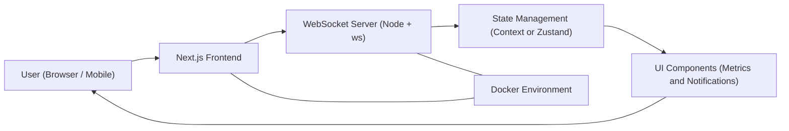
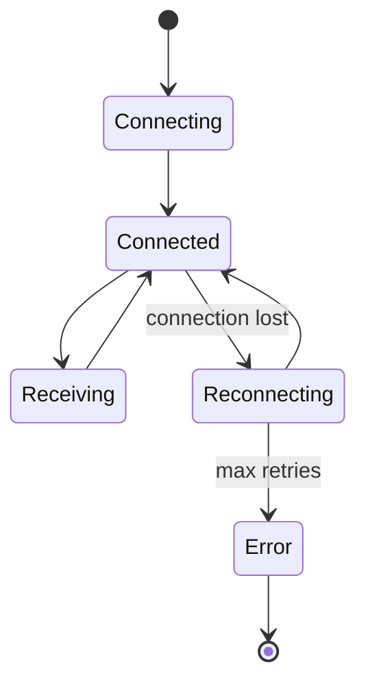
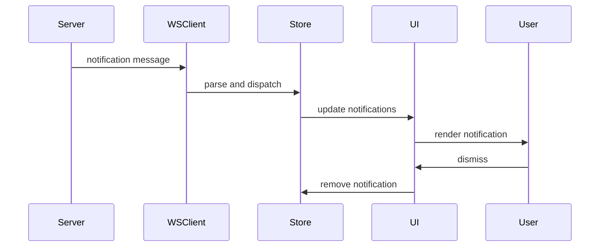
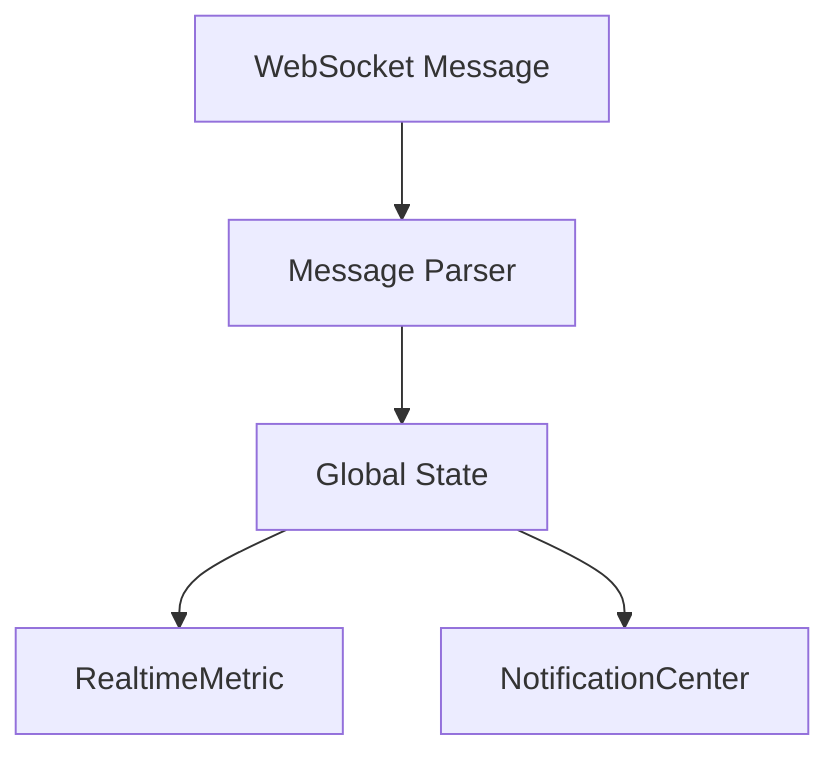
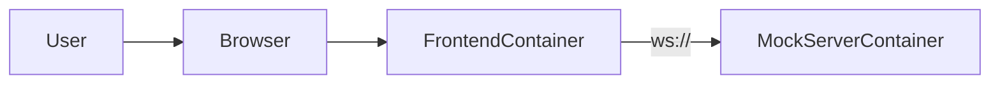
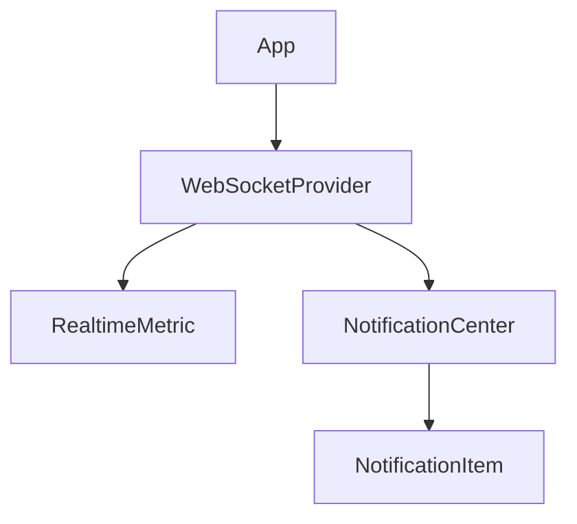

# 🚀 Real-Time Dashboard Widget with WebSockets

A production-ready, responsive React dashboard widget that displays live KPI updates and an accessible notification system using WebSockets. This project demonstrates efficient real-time data handling, robust error management, and modern frontend architecture.

---

## 📌 Project Overview

This application provides:

- ✅ Live **Active Users** metric via WebSocket  
- ✅ Real-time **Notification Center**  
- ✅ Automatic WebSocket reconnection  
- ✅ Fully responsive UI (mobile → desktop)  
- ✅ Accessible components (WCAG-friendly)  
- ✅ Dockerized deployment  
- ✅ Modular and scalable architecture  

The widget is designed to be easily embedded into larger dashboard systems.

---

## 🏗️ Architecture

### High-Level Flow



---

### 🔄 WebSocket Connection Lifecycle



---

### 🔔 Notification Data Flow



---

### 🧠 State Management Flow



---

### 🐳 Docker Architecture



---

### 🧩 Component Architecture



---

## 📂 Project Structure

```
project-root/
│
├── docker-compose.yml
├── README.md
├── .env.example
│
├── frontend/
│   ├── Dockerfile
│   ├── package.json
│   └── src/
│       ├── App.jsx
│       ├── components/
│       ├── services/
│       ├── contexts/
│       └── styles/
│
└── mock-server/
    ├── Dockerfile
    ├── package.json
    └── server.js
```

---

## ⚙️ Features

### 🔴 Real-Time Metric

- Displays **Active Users**
- Updates automatically via WebSocket
- Visual feedback on change
- Connection status indicator

### 🔔 Notification System

- Real-time push notifications  
- Individual dismiss support  
- **Clear All** functionality  
- Scrollable notification panel  
- Accessible aria-live region  

### 🌐 WebSocket Resilience

- Automatic reconnection  
- Exponential backoff  
- JSON validation  
- Error handling without crashes  

### 📱 Responsive Design

Supports:

- Mobile (≥320px)  
- Tablet  
- Desktop (≤1920px)  

---

## ♿ Accessibility

The application follows WCAG 2.1 AA best practices:

- ✅ Keyboard navigable buttons  
- ✅ Proper ARIA labels  
- ✅ aria-live for notifications  
- ✅ Focus management  
- ✅ Semantic HTML  

---

## 🔧 Environment Variables

Create `.env` from example:

```
VITE_WS_URL=ws://localhost:8080
```

---

## 🖥️ Local Development Setup

### Clone repository

```bash
git clone <your-repo-url>
cd project-root
```

### Install dependencies

```bash
cd frontend && npm install
cd ../mock-server && npm install
```

### Run locally

```bash
node mock-server/server.js
cd frontend && npm run dev
```

Open: http://localhost:3000

---

## 🐳 Docker Setup

### Build and run

```bash
docker-compose up --build
```

### Stop

```bash
docker-compose down
```

---

## 🧪 Testing

Run tests:

```bash
npm test
```

Covers:

- WebSocket logic  
- Notification behavior  
- Error handling  

---


## 🎥 Demo Video

[▶️ Watch Demo Video](https://drive.google.com/file/d/14veLiLV9pMangehTZstDMEvc-JnvgdRx/view?usp=sharing)


- WebSocket connection  
- Live metric updates  
- Notification arrival  
- Individual dismiss  
- Clear All  
- Responsive behavior  

---

## 👨‍💻 Author

**Vinay Nethala**  
CSE Student  

---

## 📜 License

This project is for educational and assessment purposes.
